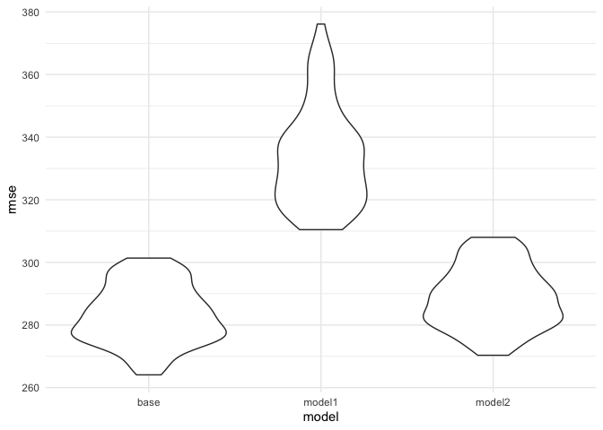

HW6
================
Stephen Powers
11/21/2019

## Problem 1

#### Loading and tidying data

``` r
birthweight = 
  read_csv("./data/birthweight.csv") %>% 
  janitor::clean_names() %>% 
  drop_na() %>% 
  mutate(
    babysex = factor(babysex, 
                     levels = c(1, 2), 
                     labels = c("male", "female")),
    frace = factor(frace, 
                   levels = c(1, 2, 3, 4, 8, 9), 
                   labels = c("white", "black", "asian", "puerto rican", "other", "unknown")),
    mrace = factor(mrace, 
                   levels = c(1, 2, 3, 4, 8, 9), 
                   labels = c("white", "black", "asian", "puerto rican", "other", "unknown")),
    malform = factor(malform, 
                     levels = c(0, 1), 
                     labels = c("absent", "present")))
```

    ## Parsed with column specification:
    ## cols(
    ##   .default = col_double()
    ## )

    ## See spec(...) for full column specifications.

#### Propose a regression model for birthweight

``` r
birthweight_base_model = 
  lm(bwt ~ gaweeks + malform + blength + bhead + babysex + wtgain + smoken, data = birthweight)
```

#### Creating residual plot

``` r
bw_plot = modelr::add_residuals(birthweight, birthweight_base_model) 
bw_plot = modelr::add_predictions(bw_plot, birthweight_base_model)

bw_plot %>% 
  ggplot(aes(x = pred, y = resid)) + 
  geom_point() 
```

<!-- -->

#### Comparing the model above to two others

``` r
bw_model1 =
  lm(bwt ~ blength + gaweeks, data = birthweight)
  
bw_model2 = 
  lm(bwt ~ bhead + blength + babysex + bhead*blength + bhead*babysex + blength*babysex + bhead*blength*babysex, data = birthweight)
```

#### Comparison in terms of the cross-validated prediction error

``` r
cv_df = 
  crossv_mc(birthweight, 100)

cv_df = 
  cv_df %>% 
    mutate(base_model = 
             map(train, ~lm(bwt ~ gaweeks + malform + blength + bhead + babysex + wtgain + smoken, data = .x)), 
           model1 = 
             map(train, ~lm(bwt ~ blength + gaweeks, data = .x)), 
           model2 = 
             map(train, ~lm(bwt ~ bhead + blength + babysex + bhead*blength + bhead*babysex + blength*babysex + bhead*blength*babysex, data = .x))) %>% 
    mutate(rmse_base = 
              map2_dbl(base_model, test, ~rmse(model = .x, data = .y)),
          rmse_model1 = 
              map2_dbl(model1, test, ~rmse(model = .x, data = .y)),
          rmse_model2 = 
              map2_dbl(model2, test, ~rmse(model = .x, data = .y)))

cv_df %>% 
  select(starts_with("rmse")) %>% 
  pivot_longer(
    everything(),
    names_to = "model", 
    values_to = "rmse",
    names_prefix = "rmse_") %>% 
  mutate(model = fct_inorder(model)) %>% 
  ggplot(aes(x = model, y = rmse)) + geom_violin()
```

<!-- -->

## Problem 2
