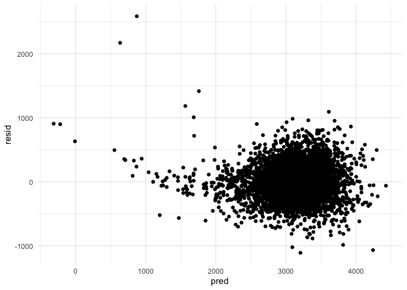

HW6
================
Stephen Powers
11/21/2019

## Problem 1

#### Loading and tidying data

``` r
birthweight = 
  read_csv("./data/birthweight.csv") %>% 
  janitor::clean_names() %>% 
  drop_na() %>% 
  mutate(
    babysex = factor(babysex, 
                     levels = c(1, 2), 
                     labels = c("male", "female")),
    frace = factor(frace, 
                   levels = c(1, 2, 3, 4, 8, 9), 
                   labels = c("white", "black", "asian", "puerto rican", "other", "unknown")),
    mrace = factor(mrace, 
                   levels = c(1, 2, 3, 4, 8, 9), 
                   labels = c("white", "black", "asian", "puerto rican", "other", "unknown")),
    malform = factor(malform, 
                     levels = c(0, 1), 
                     labels = c("absent", "present")))
```

    ## Parsed with column specification:
    ## cols(
    ##   .default = col_double()
    ## )

    ## See spec(...) for full column specifications.

#### Propose a regression model for birthweight

``` r
birthweight_base_model = 
  lm(bwt ~ gaweeks + malform + blength + bhead + babysex + wtgain + smoken, data = birthweight)
```

#### Creating residual plot

``` r
bw_plot = modelr::add_residuals(birthweight, birthweight_base_model) 
bw_plot = modelr::add_predictions(bw_plot, birthweight_base_model)

bw_plot %>% 
  ggplot(aes(x = pred, y = resid)) + 
  geom_point() 
```

<!-- -->

## Problem 2
